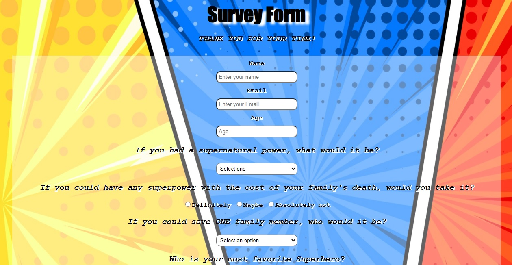

# survey-form

"Build A Survey Form" about Superheroes - Responsive Web Design Project - freeCodeCamp.

You can use HTML and CSS to complete this project.

REQUIREMENTS

User Story #1: I can see a title with id="title" in H1 sized text. 
User Story #2: I can see a short explanation with id="description" in P sized text. 
User Story #3: I can see a form with id="survey-form". 
User Story #4: Inside the form element, I am required to enter my name in a field with id="name". 
User Story #5: Inside the form element, I am required to enter an email in a field with id="email". 
User Story #6: If I enter an email that is not formatted correctly, I will see an HTML5 validation error. 
User Story #7: Inside the form, I can enter a number in a field with id="number". 
User Story #8: If I enter non-numbers in the number input, I will see an HTML5 validation error. 
User Story #9: If I enter numbers outside the range of the number input, which are defined by the min and max attributes, I will see an HTML5 validation error. 
User Story #10: For the name, email, and number input fields inside the form I can see corresponding labels that describe the purpose of each field with the following ids: id="name-label", id="email-label", and id="number-label". 
User Story #11: For the name, email, and number input fields, I can see placeholder text that gives me a description or instructions for each field. 
User Story #12: Inside the form element, I can select an option from a dropdown that has a corresponding id="dropdown". 
User Story #13: Inside the form element, I can select a field from one or more groups of radio buttons. Each group should be grouped using the name attribute. 
User Story #14: Inside the form element, I can select several fields from a series of checkboxes, each of which must have a value attribute. 
User Story #15: Inside the form element, I am presented with a textarea at the end for additional comments. 
User Story #16: Inside the form element, I am presented with a button with id="submit" to submit all my inputs. 

You can find Responsive Web Design Certification <a href='https://www.freecodecamp.org/learn/responsive-web-design/'>here</a>.
